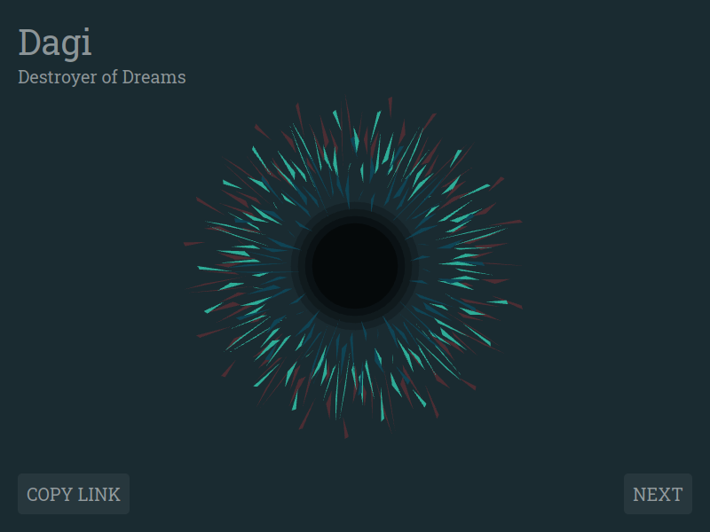
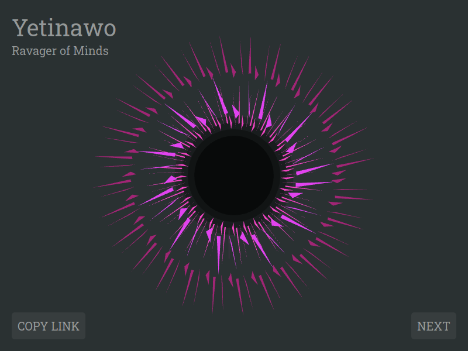
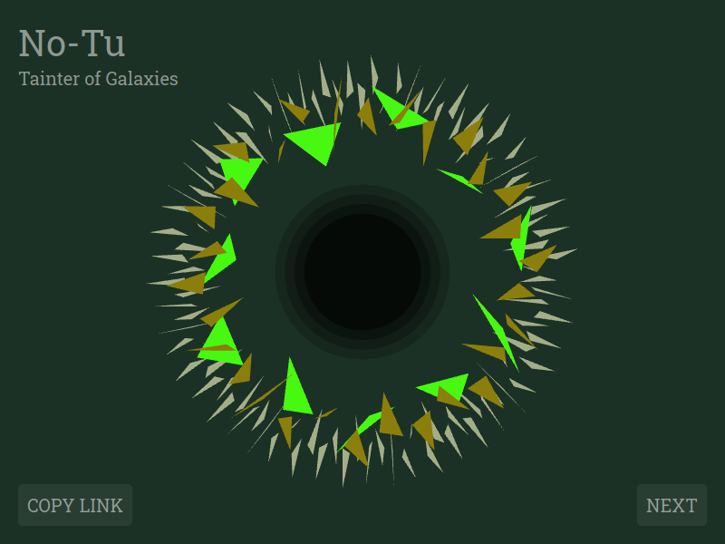

> hi every1 im old!!!!!!! \*holds up spork\* my name is cthulhu but u can call me t̷̜͚̾3̴̰̎̆ḥ̵̛̈́ ̶̠̆Ǒ̷̰̹̅c̵͔̓̈́7̶̫͌ỏ̶̥P̷͎̓͜u̵͍͗͂S̸̤͂ ̵͉̇̚o̵̘͆͠F̶͈̏̌ ̸̰̣͊̚d̷͕̼̋0̵̡͖́͝0̵̧̫͌́m̴̖͙̄!!!!!!!! lol…as u can see im very random!!!!
>
> -- <cite>Cthulhu, Holder of Spork</cite>

The Old Ones are returning, and they are *craaaazy*. They have taken the form of disembodied eyes, large as galaxies, with colorful irises, and black hole pupils. And the worst part: there is an incomprehensibly large number of them. This is why I made a catalog with their names, titles, and ugly mugs.

[See them with your own eyes!](https://eibens.github.io/cthulhu-holder-of-spork)

## Background

This was a small side-project strung together over the weekend. It is build on top of a procedural generation library I am currently developing. The library comes with a [declarative DSL](src/grammar.js) originally built for music generation, but it is apparently general enough to allow basic graphics and text generation. This sounds like a good thing, but could be a bad thing since a high level of generality means a low level of specificity and consequently less power for particular domains. Maybe it's a spork.

The original idea for generating these eyeballs came from a bug. I intended to make a polar visualization and wanted to test it with random points for a `triangle fan` primitive. I had switched on `triangles` instead and instead of a polygon I got separate random triangles around the center of the coordinate system. Increasing the number of points led to a shape that looked like an iris (my dad first saw that resemblance). One thing led to the next and this website was created.

## Screenshots

